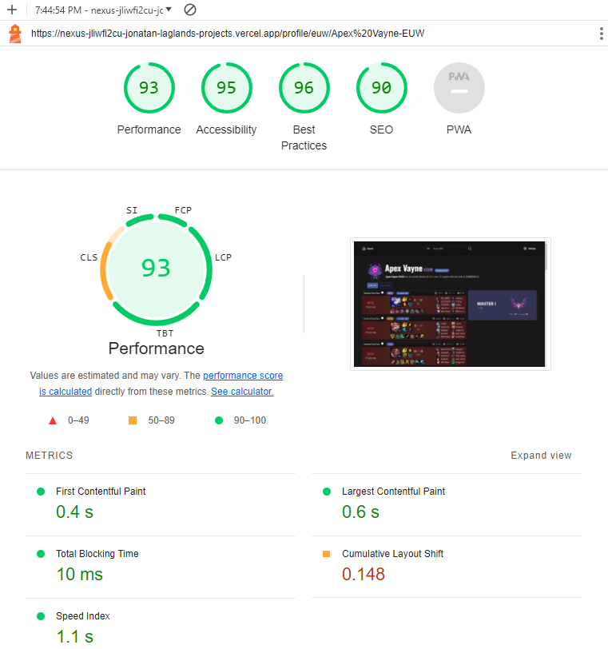

## Introduction

Nexus is a League of Legends fan project intended to help players quickly and seamlessly lookup a player's match history and live game data in one simple layout.

### Tools used

- Next.js (and React.js)
- Tailwind CSS
- JavaScript / TypeScript
- Radix
- Jest

## How to use

1. Visit [nexus-two-nu.vercel.app](https://nexus-two-nu.vercel.app/)
2. Lookup a player's profile. For example: [Thebausffs](https://nexus-two-nu.vercel.app/profile/euw/thebausffs-EUW)

## Core features

### Integration with Riot Games API

The website leverages the robust server-side features of Next.js, built on Node.js, to connect with the Riot Games API. This setup enables the dynamic fetching of essential data such as champion images and descriptions, as well as caching of fetch requests to limit excess calls to Riot Games' API endpoint.

### Responsive design

The website's responsive design is achieved through the integration of Tailwind CSS, CSS Grid, Flexbox, and JavaScript. Tailwind CSS and CSS Grid handle the structural aspects, while Flexbox ensures fluid content layout.

### Smart pagination

With the combined use of React Query's tool useInfiniteQuery and React Intersection Observer, the match history page is able to incrementally fetch matches as the user scrolls down the page. With this feature, the initial page load is faster on slower devices and unnecessary API and/or fetch calls are avoided in case the user is only interested in the most recent matches.

### Performance

With the use of React Server Components, the initial page load and subsequently First Contentful Paint (FCP) are greatly improved. For example, the profile page's "header" that displays the user's name and short description is rendered on the server, as well as the sidebar badge displaying the user's wins and losses, while the individual matches are rendered on the client.

In addition, the website's fetch requests are performed with Server Actions in order to reduce the time taken to complete each request. Server actions allow requests to be cached and served to users across the platform. [Read more on Next.js Benefits of Server Rendering.](https://nextjs.org/docs/app/building-your-application/rendering/server-components)

By implementing the aforementioned optimizations, alongside features such as [dynamic imports](https://nextjs.org/docs/pages/building-your-application/optimizing/lazy-loading#nextdynamic) and [lazy loading of images](https://nextjs.org/docs/pages/building-your-application/optimizing/images), the website performs relatively well even on slower devices. Below is a Lighthouse performance report done on the deployed website:

### Upcoming features

- Autofill suggestions for user input search
- Dropdown menu for detailed match history